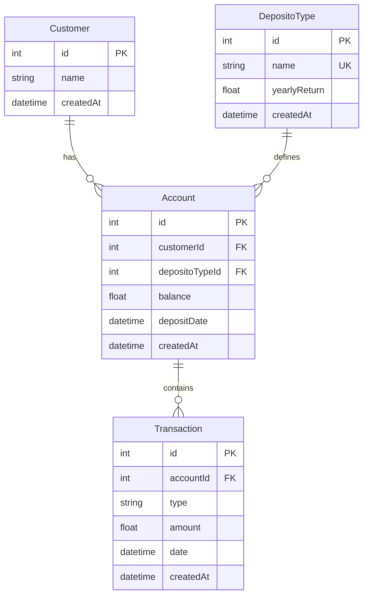
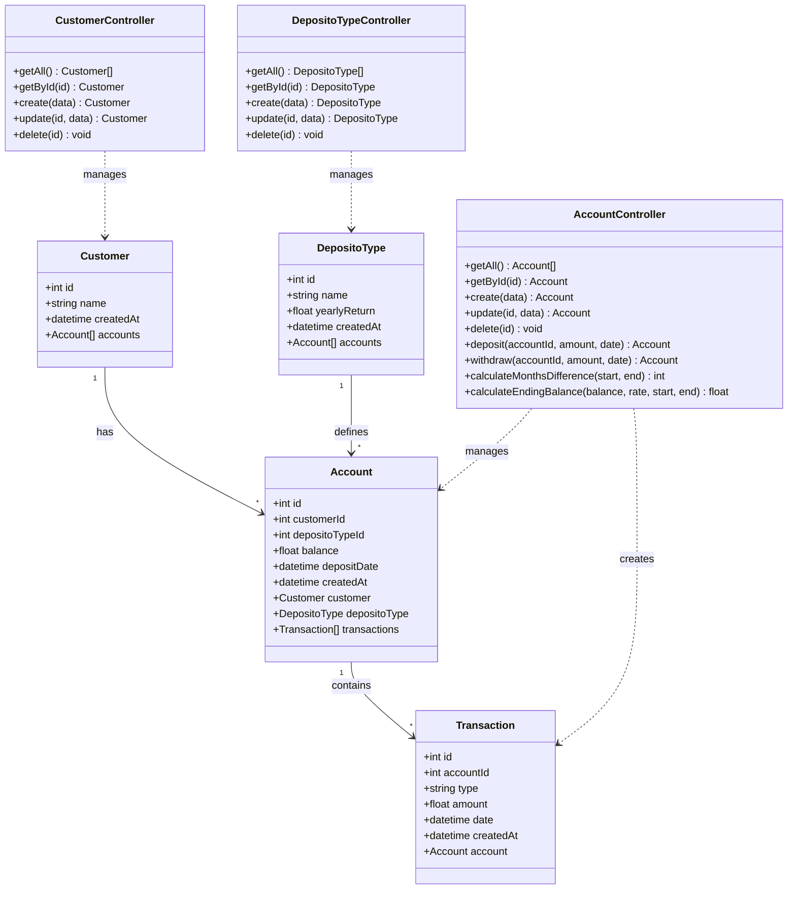
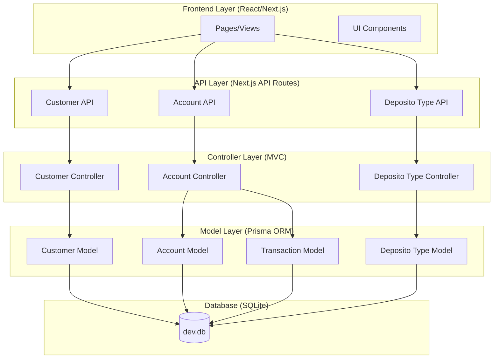
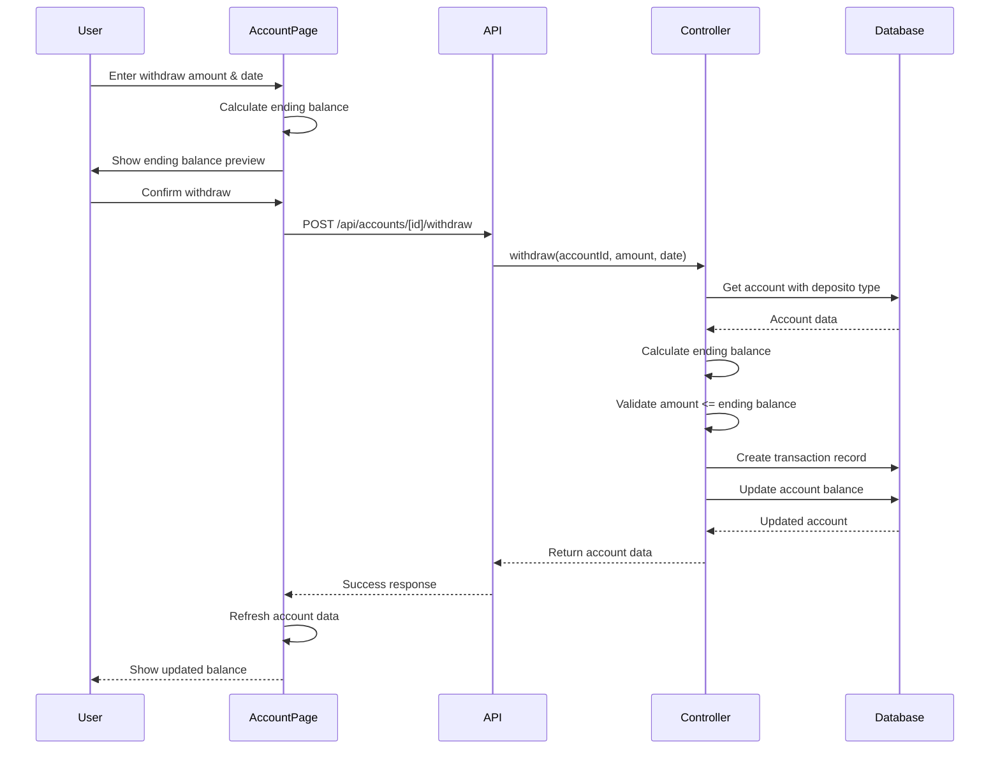
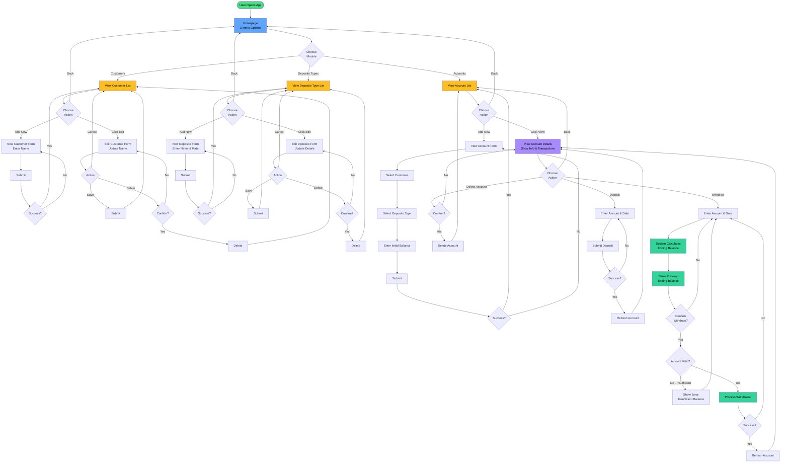

# Bank Saving System - Diagrams

## Entity Relationship Diagram (ERD)

## Class Diagram

## System Architecture Diagram

## Sequence Diagram - Withdraw Process

## User Flow Diagram - Bank Saving System

